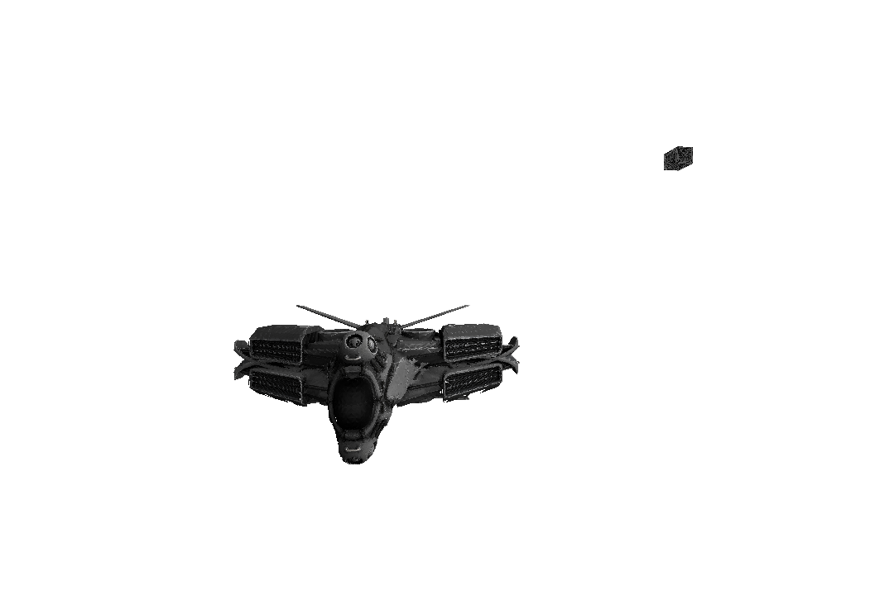
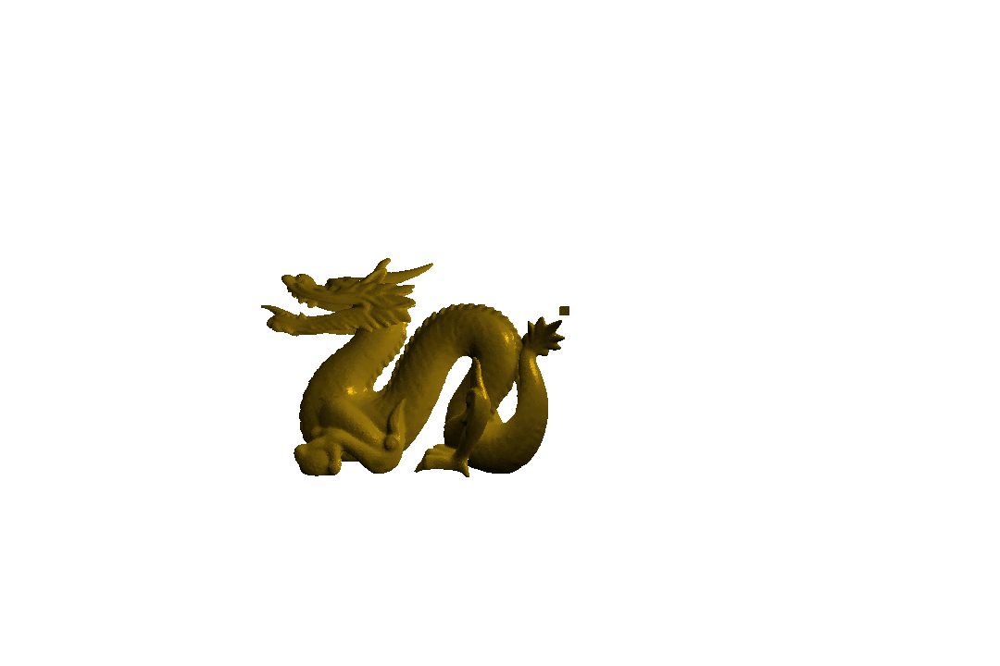
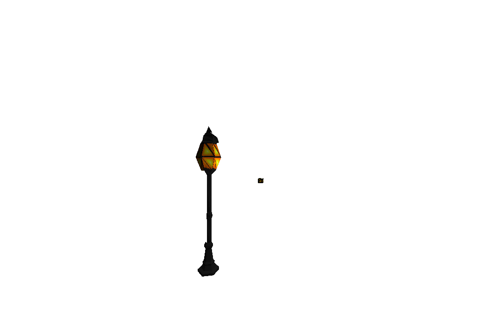

# Java Software Rasterizer

Dieses Project ist im Zuge meiner Mathe KL entstanden, um die einzelnen mathematischen Schritte zu testen, die nötig sind um ein 3D-Modell auf dem Bildschirm darzustellen. 

### Features

- OBJ-Modelloader
- (einfache) Shader unterstützung
- Multithreaded Vertex und Fragment shaderstage ausführung
- Texturen
- Blinn-Phong Lighting

### Testobjekte:
Der Würfel zeigt die Position der Lichtquelle an, die das Objekt umkreist.

Intergalaktisches Raumschiff: 

Das Stanford Dragon Modell:

Eine Lampe:

### Project Configuration and Running

Sollte das Project nicht richtig in IntelliJ importiert werden, dann muss der Ordner **resources** als Resource Ordner konfiguriert werden, und der Ordner **src** als Source Ordner.

Die Hauptklasse befindet sich unter: **src/test/Window.java**
